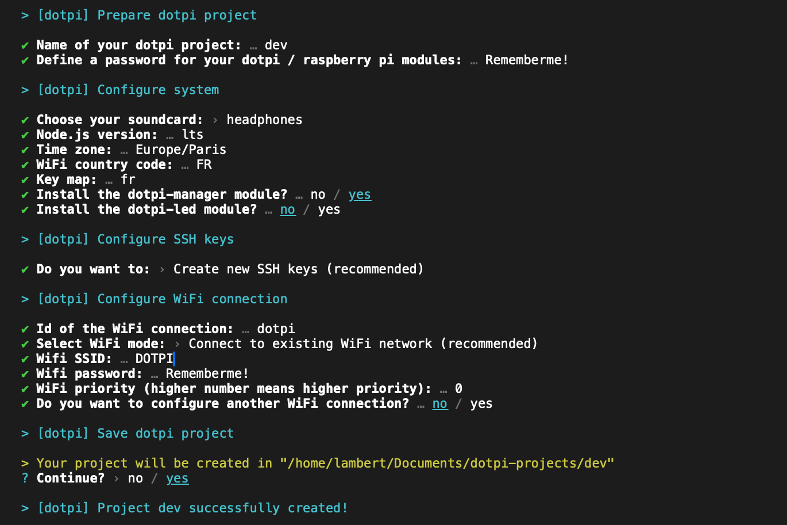

# Creating a project

## Project directory

The first time, you need to create a directory of your projects.

```sh
mkdir -p ~/Documents/dotpi-projects
```

Everytime you use `dotpi-tools` be sure to use this directory.

```sh
cd ~/Documents/dotpi-projects/
```

## Creating a new project

In directory of the projects, create a new one.

```sh
cd ~/Documents/dotpi-projects/
dotpi-tools --create-project
```

Then, follow the wizard.


Hit enter to accept a default option, or type a new value and validate with enter.



It is recommended to generate and install `SSH` keys for the new project.


Your project is then ready to be installed.


