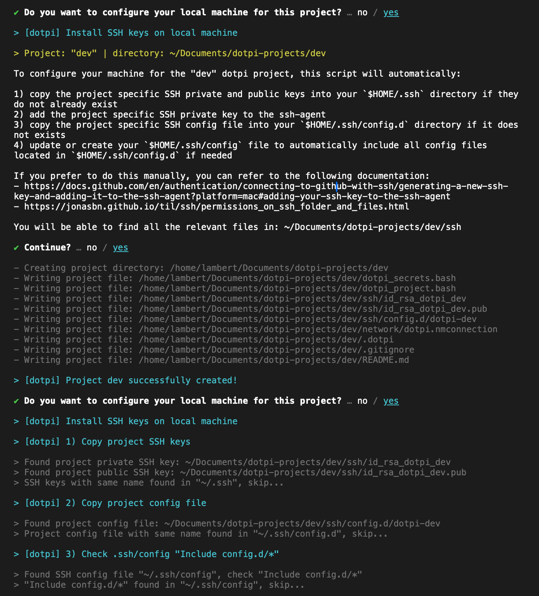

# Creating a project

A _dotpi_ project is shared among a fleet of Raspberry Pis and allows you to configure different systems such as the type of soundcard, WiFi, or SSH key. Once created, you can install a project on several Raspberry Pis.

## Project directory

First, you need to create a directory for your _dotpi_ projects. This will be a collection of projects. Choose a convenient directory - for e.g. `Documents` - and create a new one with the `mkdir` (for "make directory") command:

```sh
mkdir -p ~/Documents/dotpi-projects
```

Everytime you use `dotpi-tools`, be sure to use this directory. To go to the directory, use the `cd` ("change directory") command in the terminal:

```sh
cd ~/Documents/dotpi-projects/
```

## Creating a new project

Now that you're in the proper directory, create a new project using the `dotpi-tools` wizard:

```sh
cd ~/Documents/dotpi-projects/
dotpi-tools --create-project
```

Your terminal should look like the following:


Then, follow the wizard. It will allow you to configure systems (soundcard, WiFi, keyboard, SSH, etc.) and install some modules (dotpi-manager). Press `Enter` to accept default options, or type a new value and confirm with `Enter`.


It is recommended to generate and install `SSH` keys for the new project.



Your project is now ready to be installed on a Rasberry Pi.


<a class="action" href="./installing-a-raspberry-pi.html">Installing a Raspberry Pi</a>
