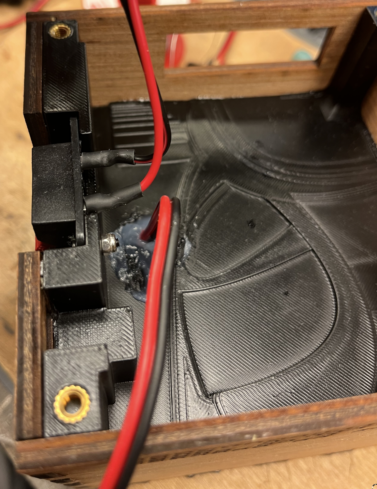
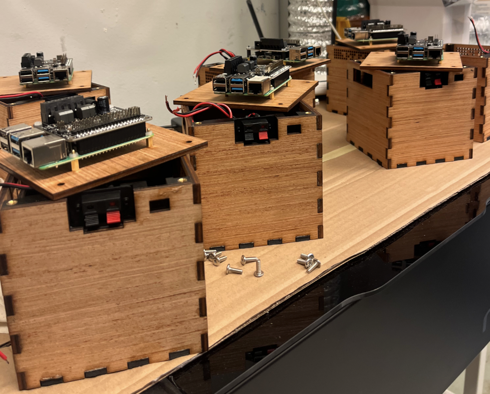

# Assembling pieces

In this chapter, we will describe how to assemble and glue all the pieces together

## First glueing move

The first assembling move consists in glueing wooden faces 2, 3, 4 and 5 together with the separation part. 

::: tip
As glueing parts together can be tricky, we strongly recommend you to simulate pressing all the part with clamps without glue in order to make sure you do not miss something and everything fits together
:::

Apply wood glue on the red highlighted parts :

Apply epoxy glue on the blue highlighted parts :

Assemble all parts including unglued face 1 (in order to make sure it will fit later) and press the sides together with your clamps, making sure there isn't space in between the faces you are glueing and that the plastic separation fits perfectly within the box :

::: info
At this point, you might have to wait for the glue to be effective before going further
:::

Apply silicon seals inside the box on the highlighted parts (this will ensure speaker's cabinet tightness):

And add the inside speaker foam:

## Second glueing move

Apply epoxy glue on the blue highlighted parts of face 1 and on the wood that will touch the face :

::: warning
Don't forget to pass the cable through the separation hole before glueing face 1!
:::

Fit it with the rest of the box and apply pressure with clamps using a wooden block and face 6 on the other side to distribute the pressure:

:::info
In the picture below, wooden parts have been coloured in black
:::

## Closing the box 

In order to close and be able to use the box, you need to fix the 4 M4x6 het-set inserts in the separations holes provided for this purpose, apply silicon to the hole around the speaker cable (to improve cabinet tightness), and optionally fix and weld to a cable the external speaker connector

Fix the USB-C trigger board at his position with epoxy glue:
<!-- TODO : picture of the usb-c trigger board fixed -->

You can now fix the Raspberry Pi and Amp module to face 6 using M2.5 screws and M2.5 spacers. Plug the USB-C trigger boards cables to the amp power inlet, plug the to other cables to the left and right outlet of the amp and tada!

You now have a (almost) fully functional distributed speaker! You now have to refer to the [dotpi-tools](../dotpi-tools/requirements.md) tutorials in order to install the required software on the Raspberry Pi in order to use it as a distributed musical thing.

