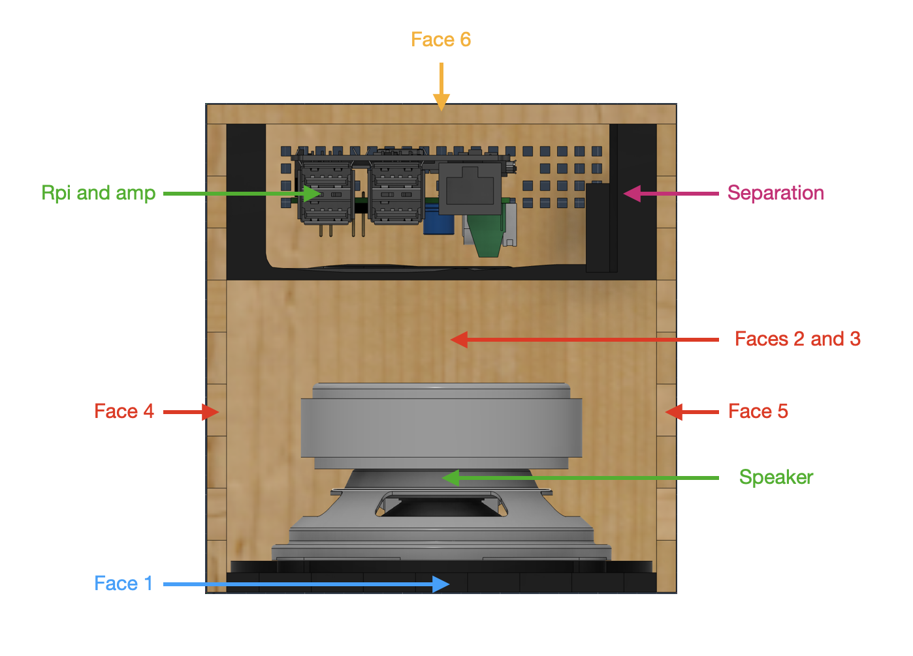

# Overview and general principles

In order for you to know where you are going, we will have a little tour on the project and the main idea of this box

The box is made of four wooden fingered joints faces (face 2 to 5), one plastic fingered joined face (face 1) on which the speaker is fixed and one wooden flat joined mobile part (part 6) on which the pi module is fixed.

Because a speaker cabinet must (in general) be a tight area, and because a Raspberry Pi and Amp module tend to release heat and must be accessible, the two systems are separated by a  plastic separation that also acts as a support for external ports (power supply) and as a guide when mounting the box.

The materials used for each part are :

-  Faces 2, 3, 4, 5 and  face 6 : 5mm plywood
- Face 1 : PAHT-CF (PA12 and carbon fiber composite)
- Separation : regular PLA

The main idea will be to laser cut all the wooden part, 3D print the plastic, and glue everything together in the right order. :wink:  