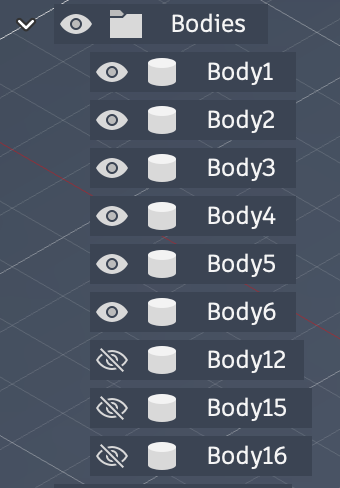
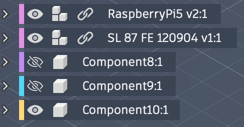
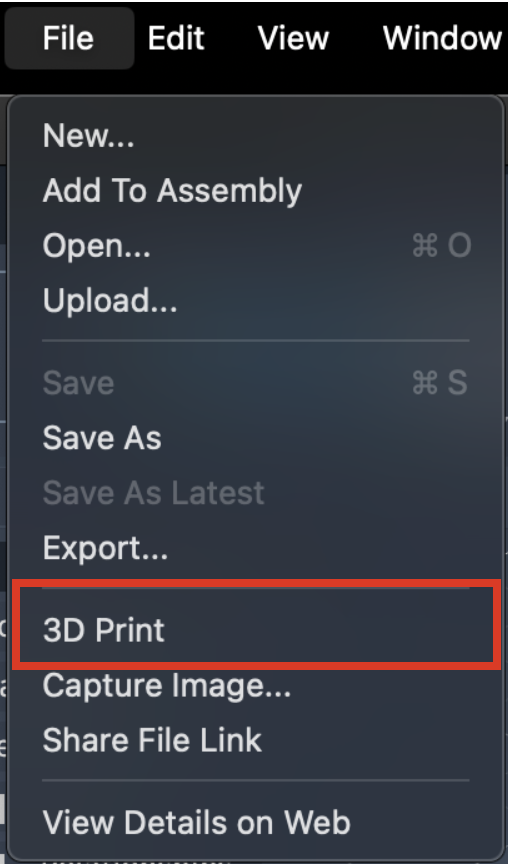
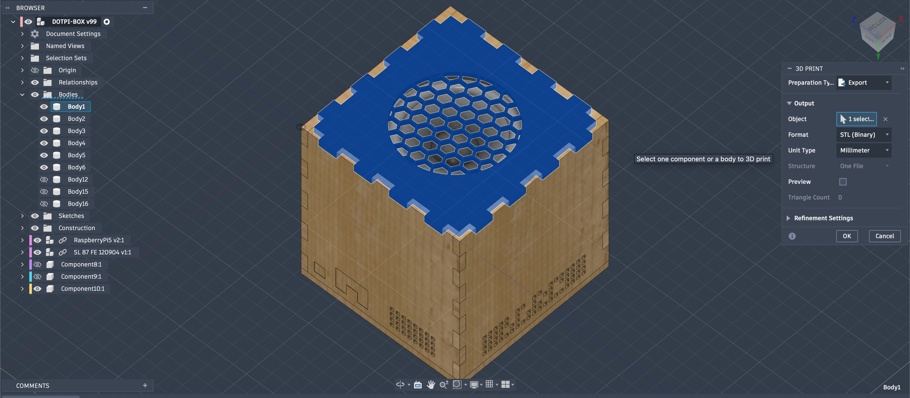
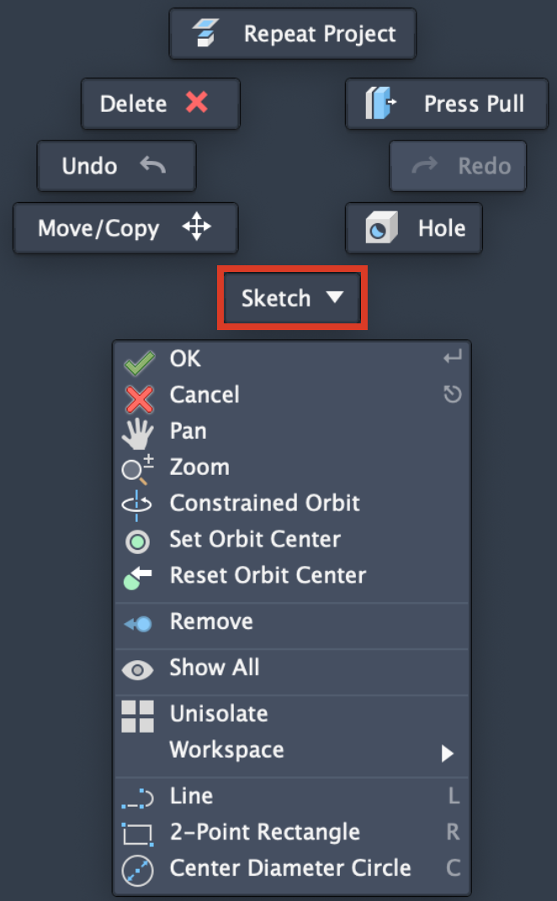
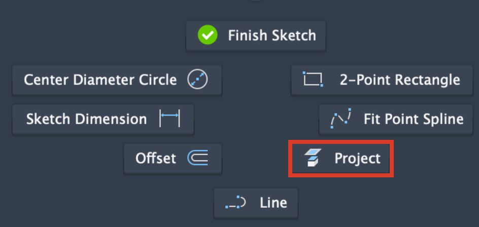
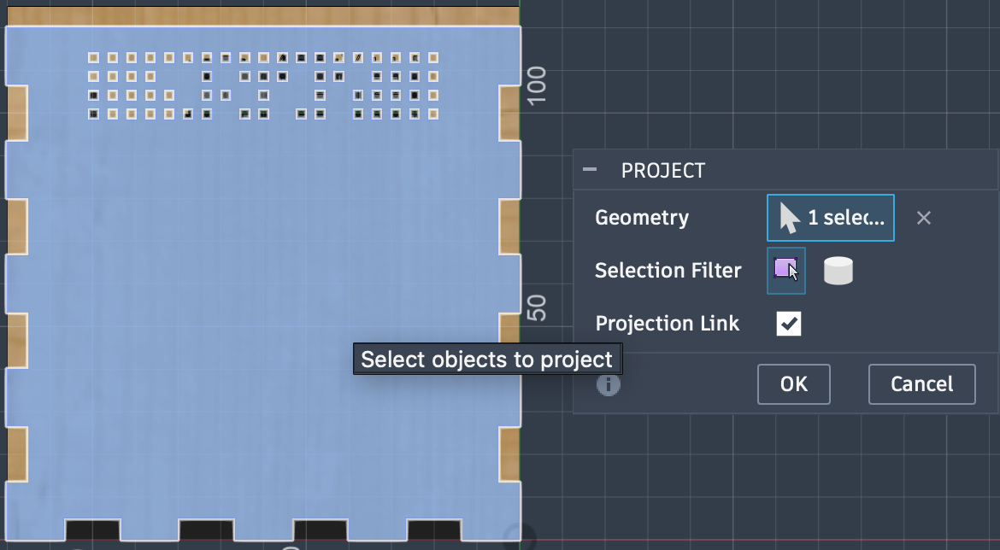
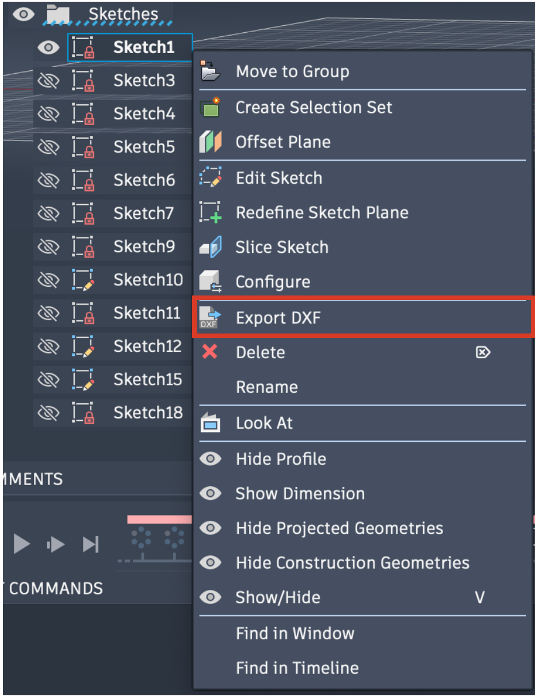

# Shape your box

If for any reason you would like to modify the project (e.g. different hardware pieces or different needs), you can modify the [Fusion 360](https://www.autodesk.com/fr/products/fusion-360/overview) project downloadable at [this link](../assets/modify-the-project/dotpi-box-v99-fusion-project.zip).

## Structure of the project

The project is structured around 6 bodies (corresponding to the 6 faces of the box)

And three components: the Raspberry Pi + Amp module, the Visaton SL 87 FE speaker, and the separation body inside the cabinet (component10:1).

You can find all the sketches and extrusions in the timeline at the bottom of the project and modify them as you wish!

## Exports

We will briefly introduce how to retrieve *.stl* and *.svg* exports from the bodies of the Fusion project.

### Exporting STLs

If you want to export *.stl* files in order to 3D print them (or do whatever you want to do with it), simply select **3D print** in Fusion's file menu.

{width=250px}

Select the body you want to export (typically body1 or component10:1), select **STL** as format and **Millimeter** as unit type then click OK.

### Exporting DXFs

If you want to export *.dxf* files in order to laser cut faces (or do whatever you want to do with it), right click anywhere in Fusion venue.

Select **Sketch** in the drop down menu.

{width=300px}

Then select **Project**.

{width=300px}

Select the face you want to project then click OK

You will then find the projection in the Sketches menu on the left hand side of the venue. Right click on it and select **Export DXF**

{width=300px}

## Conclusion

You can now use your own *.stl* and *.dxf* files to 3D print and laser cut your customized pieces!