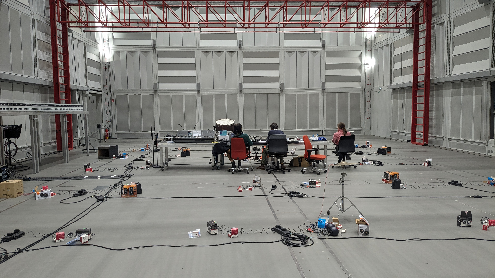

# dotpi | documentation

The _dotpi_ ecosystem aims at facilitating the creation and maintenance of a fleet of Raspberry Pi nano-computers to run distributed audio applications.

<a class="action" href="./requirements.html">Getting Started</a>

## Features

The set of tools provided _dotpi_ run both on a server and on each Raspberry Pi. In short, _dotpi_ provides:

- A way configure and install the system on the Raspberry Pi, e.g. sound card, network
- Some service and daemons, e.g. ensure that the audio and the network always run
- Some command line tools, e.g. to install and remove a service
- A manager to deploy, run and monitor your projects on a fleet of pi
