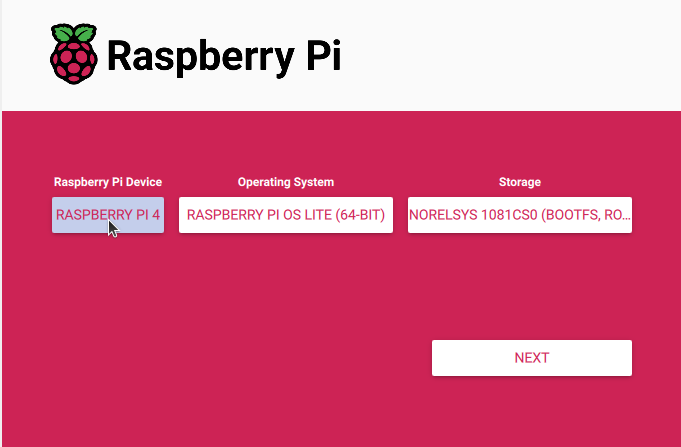
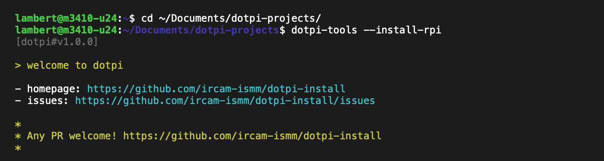
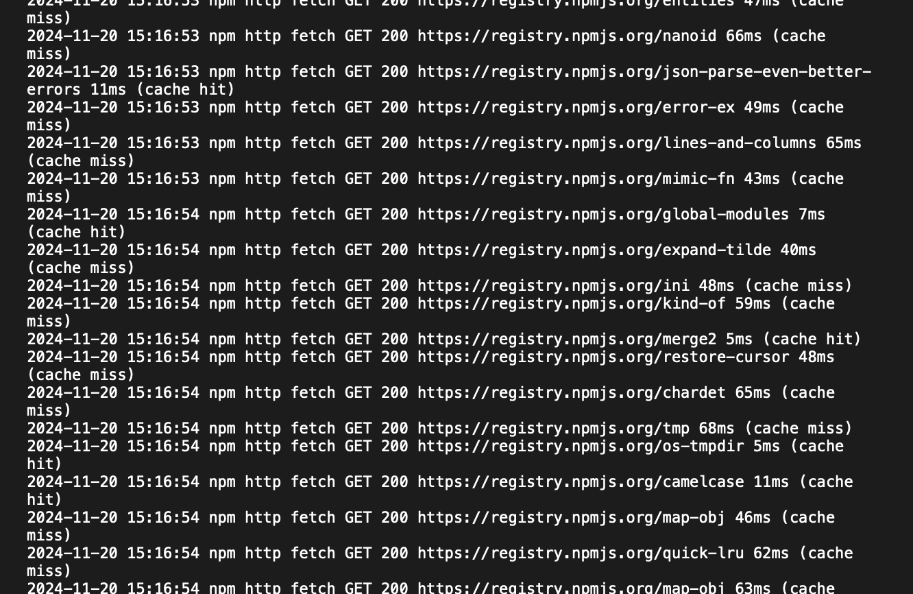

# Installing a Raspberry Pi

On this page, you'll be shown how to install a project on several Raspberry Pis. First, you will see how to install Raspberry Pi OS on an SD card. Then you will see how to install _dotpi-tools_ and your _dotpi_ project on the SD card. This will allow you to remotely monitor your fleet of Raspberry Pis thanks to the _dotpi manager_.

## Installing Raspberry Pi OS

First, you will flash an SD card to install the `Raspberry Pi OS`.

Run `Raspberry Pi Imager`, also called `rpi-imager`. If you haven't done it yet, please [download the application](https://www.raspberrypi.com/software/). You can also read the [documentation](https://www.raspberrypi.com/documentation/computers/getting-started.html#raspberry-pi-imager).

First, select your Raspberry Pi device.




Then, select the operating system (OS). We support the current `Raspberry Pi OS` (`Bookworm`) Lite 64-bit.


You can select the 'Lite' version to use less resources on a headless Raspberry. It is located in `Raspberry Pi OS (Other)`.


Insert an SD card in your computer, and select it.


Press `Next`.


::: info
By default, the imager will automatically eject the SD Card when the installation terminates. This behavior can be changed in the `Option` tab of the imager settings.
:::


::: tip
Any imager customisation is over-ridden by the project customization. For consistency, you should avoid the imager customization.
:::


Press `yes` to continue.


Wait until the end of the process.


Do _not_ remove the SD card yet. Before that, you will need to install _dotpi_ on it. You should see a volume called `bootfs` mounted in your machine.

If the imager automatically ejected the SD Card after flashing, just re-plug the SD Card to apply the _dotpi_ configuration.

## Installing _dotpi_ and project

This step will copy the _dotpi_ installer with your project customizations to the SD card.

Go to the directory of the _dotpi_ projects and write the following command:

```sh
cd ~/Documents/dotpi-projects/
dotpi-tools --install-rpi
```

Your terminal should look as the following:



Select the project you want to install and press `Enter`.
Then, follow the wizard.

Press `Enter` to accept a default option, or type a new value and validate with `Enter`.


Depending on your system, you may need to enter a password to access the SD card.


::: info
If there is an error related to the SD card, unplug it and plug it back to your machine.
Then, start again the installation.

```sh
cd ~/Documents/dotpi-projects/
dotpi-tools --install-rpi
```

:::

The installation will continue.


At the end, you need to eject the SD card from your machine. Insert it in a Raspberry Pi and turn it on.


After the network is enabled on the Raspberry Pi (wired or wifi), you can monitor the distant installation of the Raspberry Pi.



After a while, the system of the Raspberry Pi is prepared.

```log
2024-11-20 15:17:51 INFO: System prepared.
```

The system reboots, this closes the connection.

```log
2024-11-20 15:17:51 INFO: Rebooting...
Connection to dotpi-dev-123.local closed by remote host.
```

After the reboot, the Raspberry Pi is ready. It will connect to the WiFi, and to the `dotpi-manager`.
