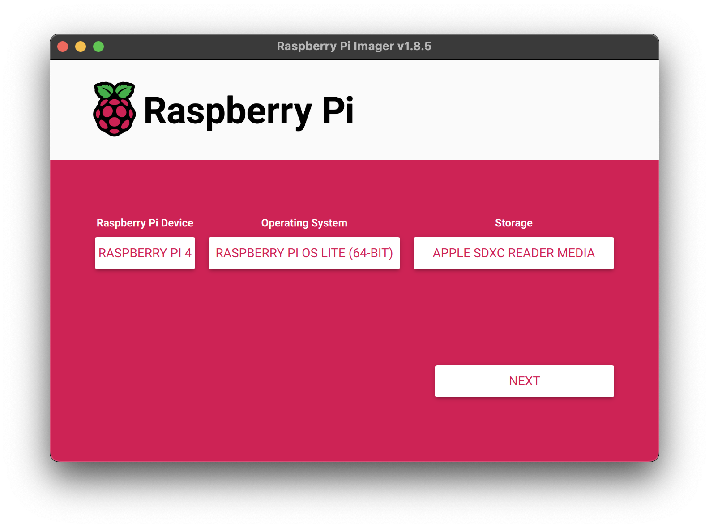
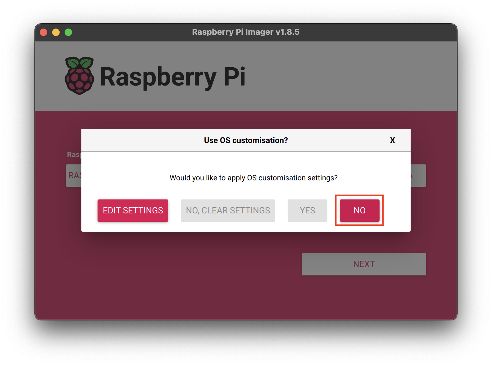
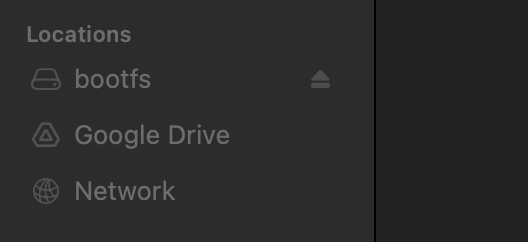
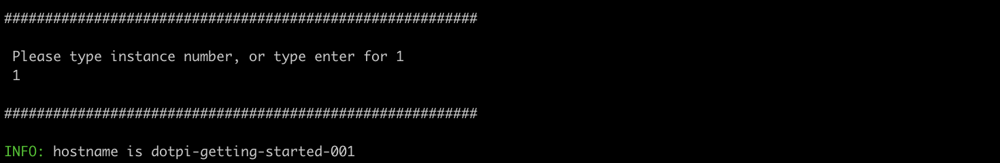
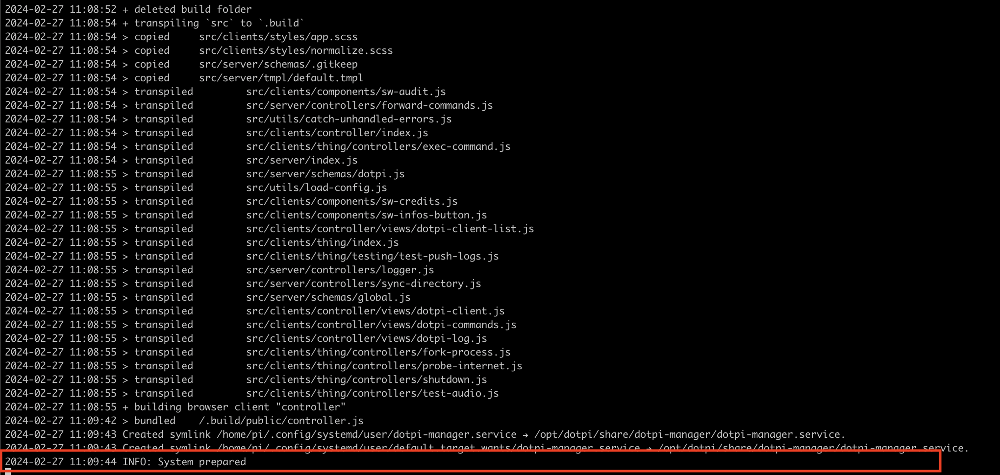

# Getting started

In this first guide we will see how to use the `dotpi-install` tools to setup a Raspberry Pi, and how to monitor and control it remotely using the `dotpi-manager`

## Cloning the `dotpi_install` tools

```sh
git clone https://github.com/ircam-ismm/dotpi-install
```

## Creating a project

The repository comes with a set of _dotpi_ project configuration examples that you can see in `projects` directory. In this guide, we will use the `example_development` project as a starter for creating a new project. So let's first copy this directory before exploring the project structure and make some modifications:

```sh
cd path/to/dotpi-install
cp -R projects/example-development projects/getting-started
```

If you open the project in your favorite editor, you should see the following directory structure:

```sh
getting-started
├── configuration           
│   └── dotpi_project.bash
└── secrets               
    ├── network 
    │   └── components  
    ├── ssh         
    │   ├── id_rsa_dotpi_example
    │   └── id_rsa_dotpi_example.pub
    └── dotpi_project.bash  
```

The directory name should be quite self-explanatory, but, just in case, you should be careful to never share publicly (e.g. on github) the files located into the `secrets` directory.

### Project public configuration

Let's first open the `getting-started/configuration/dotpi_project.bash` file to change some of the project global setting:

```sh
dotpi_project_name='example' # [!code --]
dotpi_project_name='getting-started' # [!code ++]

dotpi_ssh_allow_password_authentication='yes'

dotpi_timezone='Europe/Paris'
dotpi_keymap='fr'

dotpi_audio_device='HiFiBerry DAC+ ADC Pro' # [!code --]
dotpi_audio_device='Headphones' # [!code ++]

# use node.js specific version
# default is lts
dotpi_node_version='lts'
```

- The `dotpi_project_name` will mainly define the hostname format of the RPis configured with the project, e.g. `dotpi-getting-started-001`
- The `dotpi_audio_device` will configure the audio output of your RPi, setting to `headphones` will disable the HDMI audio output to keep only the default mini jack of the RPi.

Now that some general information about our project are defined, let's configure some secrets of the project. 

### Change the password

First let's change the password of the RPi. Open the `getting-started/secrets/dotpi-secrets.bash` bash file and change the password to anything that suits you:

```sh
#!/bin/bash
dotpi_password='!raspberry' # [!code --]
dotpi_password='yoursuperpasssword'  # [!code ++]
```

Setting the password is mandatory, the installation will fail if this is not done

::: info
Note that in this first guide, we don't configure nor use any SSH keys. In very simple settings that could be OK, but it is likely that you will soon find such functionality convenient. See [@todo](../index.md) for further information on that point.
:::

### Wi-Fi configuration

Finally, let's configure the WiFi connection, so that:
- You will be able to access the RPi through SSH or something
- The RPi will be able to connect to the Internet to install itself in the next step

Open the `getting-started/network/wifi-local.nmconnection` file and change the following lines to put the information from you WiFi connection:

```txt {10,14}
[connection]
id=wifi-internet
type=wifi
interface-name=wlan0
autoconnect=false
autoconnect-priority=-10

[wifi]
mode=infrastructure
ssid=YourBoxSSID

[wifi-security]
key-mgmt=wpa-psk
psk=ThePassword

[ipv4]
method=auto

[ipv6]
addr-gen-mode=default
method=link-local

[proxy]
```

Now that we have configured all the most important points, let's prepare our SD Card.

## Preparing the SD Card

To prepare the system image, we will simply use the [Raspberry Pi Imager](https://www.raspberrypi.com/software/) provided by the Raspberry Pi foundation. 

1. Insert a SD Card into your computer
2. Launch the Raspberry Pi Imager
3. Select the Raspberry Pi target
4. Select the operating system, e.g. Raspberry Pi OS Lite 64bit for RPi 4 or 32bit for RPi 3

You can now click on the "NEXT" button


On the next screen, select "NO" to not apply any customization setting, these settings will be applied from your project configuration file by the _dotpi install_


Finally, click on "YES" to start the installation of the system on the SD Card


By default, the Imager will automatically eject the SD Card when the installation terminates. So let's just re-plug the SC Card so that we can apply the _dotpi_ configuration on the SD Card.

::: info
Note that this behavior can be changed in the "Option" panel of the Raspberry Pi Imager settings
:::

Once re-plugged into your computer, you should see a volume called `bootfs` mounted in the "Finder"




Let then go back into your "Terminal" and launch the following command to finalize the preparation of the SD Card with your _dotpi_ project configuration:

```sh
# go into the dotpi-install directory
cd path/to/dotpi-install
# launch the command that will finalize the preparation of your SD Card
# giving the path to the project configuration
./dotpi_root/bin/dotpi_prepare_sd_card --project projects/getting-started/
```

The tool will ask you for an instance number, just put "1" for example.



As you can see this number will be used to define the `hostname` of your RPi, which will stand to be really useful when you will have multiple of them running.

## Booting the Raspberry Pi

Now that the SD Card is fully prepared, you can just plug it in your Raspberry Pi and power it on.

If you'd like to monitor the installation of the system, you can just run the command that the tool proposed you on the last line:

```sh {4}
INFO: You can monitor the preparation of the system with the following command
INFO: (You will have to wait until the network is ready.)
INFO:
INFO: ssh pi@dotpi-getting-started-001.local 'tail -f /opt/dotpi/var/log/dotpi_prepare_system_*.log'
```

Once the network is ready and the ssh able to establish a connection, your system (as it's never seen this host key before) might prompt:

```sh
"The authenticity of host dotpi-getting-started-001.local can not be established.
Are you sure you want to continue connecting (yes/no/[fingerprint])?"
```

Type "yes" and enter.

After a few minutes, you should see a log saying `INFO: System prepared`:



::: info
The installation process requires an internet connection to the oustide world in order to install dependencies. Make sure you have an internet connection and note that installation time depends on your bandwidth.
:::

Your RPi is ready! Let's now install and launch the _dotpi-manager_

## Using the `dotpi-manager`

The _dotpi-manager_ is a [_soundworks_](http://soundworks.dev) application aimed at managing and controlling fleets of RPi. It is composed of:
- a Node.js server that should run on your computer
- a Browser client to monitor and control your fleet of devices
- a Node.js client that runs on the RPi and that is automatically installed by the _dotpi-install_ tool.

Let's first clone the manager on your computer:

```sh
git clone https://github.com/ircam-ismm/dotpi-manager
```

Then install the dependencies and launch the application:

```sh
cd path/to/dotpi-manager
npm install
npm run dev
```

::: tip
Make sure your computer is on the same network as the one you configured for the RPi in the install step
:::

Once the server is up and running, go to <a href="http://127.0.0.1:9000" target="_blank">http://127.0.0.1:9000</a>, and Tada! you should see your RPi in the interface:


Now if you click the check-sound bang (on the right-hand side of the RPI status in your manager), you should hear a full volume short white noise coming out of the mini jack output of your RPI. 

## Conclusion

In this tutorial, you have learned how to simply prepare a Raspberry Pi using the _dotpi-install_ tool and how this tool relates to the _dotpi-manager_ application.

In a following tutorial, we will see how to generate and install SSH keys for your _dotpi_ project, which will simplify to a great extent the way you can interact with your RPis


