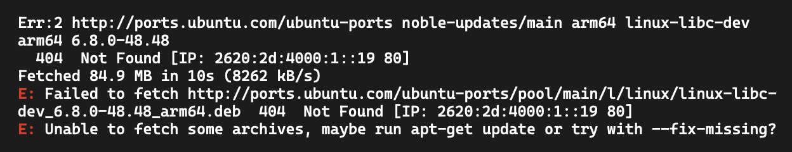

# Setting up a dev machine

For a general information, please see [Web development](https://ircam-ismm.github.io/webaudio-tutorials/first-steps/setting-up-environment.html)

On any host, _dotpi_ requires:

- [Node.js](https://nodejs.org/) LTS (long-term support) version
- [Raspberry Pi Imager](https://www.raspberrypi.com/software/)

## Linux

Install the common requirements:

- `npm`
- `rpi-imager`

Install also the following packages:

- `git`
- `make`
- `curl`
- `openssl`

## MacOS

- install `Xcode` and the command-line tools

## Windows

The _dotpi_ system will run inside the `Windows Subsystem for Linux`, `WSL`. It requires `Windows` version 10 or 11, and allows the run an almost complete `Linux` system within `Windows`.

The first time, run a `Windows PowerShell` as administrator.

Update `WSL` :

```
PS C:\Users\spamm> wsl --update
Checking for updates.
The most recent version of Windows Subsystem for Linux is already installed.
PS C:\Users\spamm>
```

Then, install a recent `Linux` distribution. (Ubuntu 24 is known to work.)

```
PS C:\Windows\system32> wsl --install Ubuntu
Launching Ubuntu...
root@m3410-w11:~#
```

Then, use `wsl` for _any_ shell command.

First, install _all_ `Linux` requirements mentioned above.

```
PS C:\Windows\system32> wsl
Launching Ubuntu...
root@m3410-w11:~# sudo apt install git make curl openssl
```

If you get errors, read the messages.



Then, try to solve the problems (within `WSL`).

```
root@m3410-w11:~# sudo apt-get update
root@m3410-w11:~# sudo apt-get update --fix-missing
```

Finally, install the packages again (still within `WSL`).

```
root@m3410-w11:~# sudo apt install git make curl openssl
```

Be sure to install `Node.js` _within_ `WSL`.

```
PS C:\Windows\system32> wsl
Launching Ubuntu...
root@m3410-w11:~# sudo apt install npm
```

`Raspberry Pi Imager` is an exception: Do _not_ install it within `WSL`. (Later, do _not_ run it within `WSL`.)

::: info
For windows, run _any_ shell command within `WSL`.

If you are not logged as `root` within `WSL`, you need to prefix commands with `sudo` to install packages.
:::

## Installing `dotpi-tools`

```sh
npm install --global @dotpi/tools
```

::: info
Depending on your installation of `Node.js`, you may need to use `sudo` to install global packages.

If you do not need it, do not use `sudo`, as it may lead to other problems.

```sh
sudo npm install --global @dotpi/tools
```

:::

Now, the command `dotpi-tools`should be available in your machine.

::: tip
If you prefer to use `npx` rather than installing the package globally, just replace `dotpi-tools` by `npx @dotpi/tools` in the remaining of these tutorials.
:::
