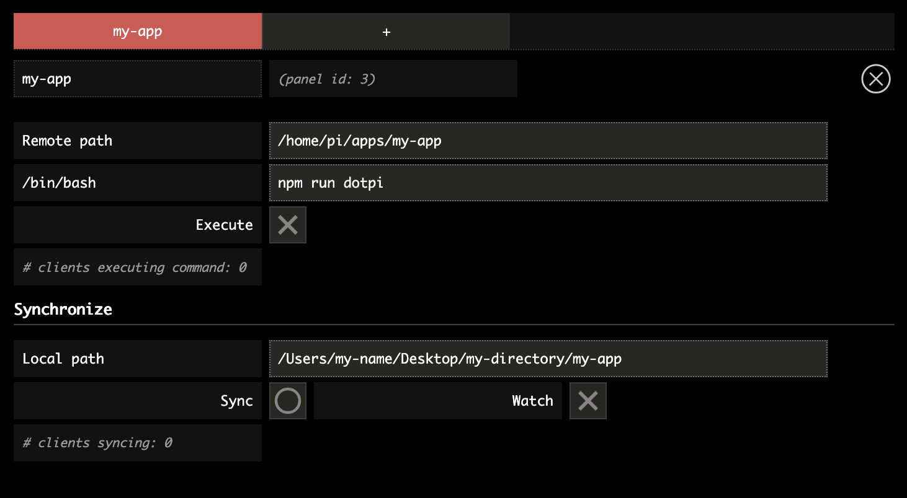

# Using the `dotpi-manager`

The `dotpi-manager` is a [_soundworks_](http://soundworks.dev) application aimed at managing and controlling fleets of RPi. It is composed of:

- a Node.js server that should run on your computer
- a Browser client to monitor and control your fleet of devices — which is called _controller_
- a Node.js client that runs on the RPi and that is automatically installed by the _dotpi-install_ tool.

## Installing the `dotpi-manager`

First, you need to install the `dotpi-manager`.

Choose a directory where you will install it, for e.g. `Documents`.

```sh
cd ~/Documents
```

And clone the git project:

```sh
git clone https://github.com/ircam-ismm/dotpi-manager.git
```

Go to the project directory and install the dependencies with the `npm install` command:

```sh
cd ~/Documents/dotpi-manager/
npm install
```

## Running the `dotpi-manager`

To run the _dotpi-manager_ application, go to its directory and execute the `npm run dev` command to launch the server:

```sh
cd ~/Documents/dotpi-manager/
npm run dev
```

Now, it is up and running.

## Accessing the `dotpi-manager`

::: tip
Make sure your computer is on the same network as the one you configured for the RPi in the install step
:::

Once the server is up and running, go to <a href="http://127.0.0.1:9000" target="_blank">http://127.0.0.1:9000</a>, and Tada! you should see your RPi in the interface:


::: info
Caution! it will be loud: Do _not_ plug headphones to the Raspberry Pi before the following test.
:::

Now if you click on the check-sound bang (on the right-hand side of the RPI status in your manager), you should hear a full volume short white noise coming out of the mini jack output of your RPI.

## Using the `dotpi-manager`

The controller interface is made of three main zones: 
1. Scripting zone
2. List of your dotpi clients
3. Console 


On the top right of the screen, you will find usefull buttons to: 
- display in full screen mode
- restart _dotpi_ clients
- turn off _dotpi_ clients


### 1. Scripting



In this part of the window you can:
- create several tabs ("pannels") corresponding to your different apps or projects. To delete a tab, press the (`X`) button at top right. 
- clone a project from your local directory to your Raspberry Pi using the `Synchronize` fonctionnality: Write the path of your directory and press the `Sync` button. If the `Watch` mode is activated, the directory on your Raspberry Pi client will be automatically updated each time the source project is modified in your local directory.
- run a command using the `bash` shell: write the command and press `Execute`. To exit a process, press again the `Execute` button.

### 2. _dotpi_ clients


The list of all your _dotpi_ clients will appear on this part of the window. The different icons indicate if the client is (1) connected to the network, (2) connected to the Internet, (3) synchronizing directories, (4) executing a command. 
You may as well (5) filter actions or (6) logs, and (7) play some sound (`noise` or `sweep`).

### 3. Logs
The logs of your client(s) are displayed on this part of the window. 

If you click on the `stderr` button (for 'standard error'), this will filter the logs to display only the errors: 


Press the delete button (`X`) at top right to clear all logs.